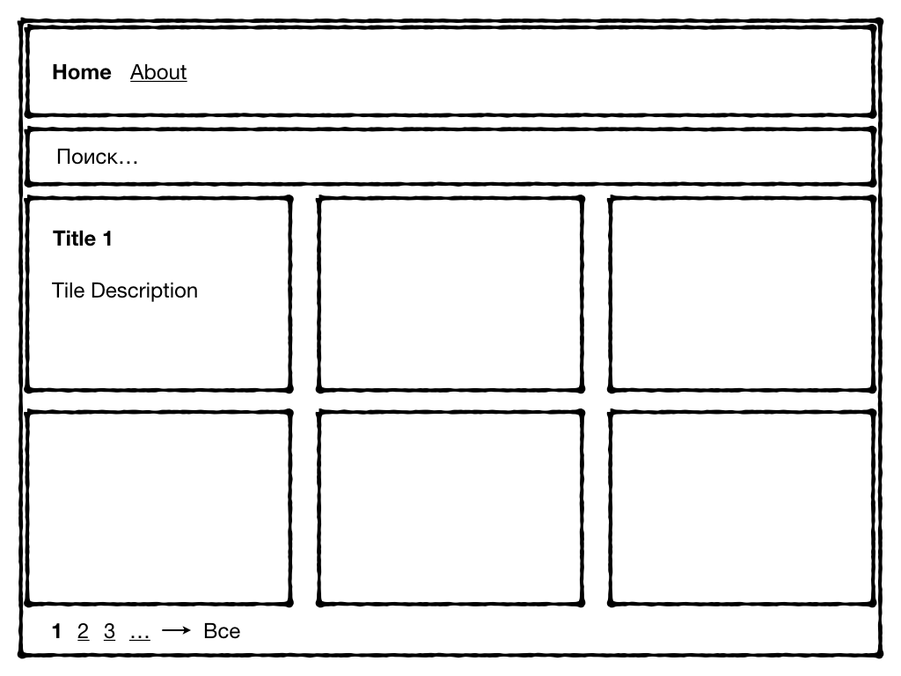

# Тестовое задание на должность Frontend-разработчика

## Clause

Разрешается выполнять задание на React или Angular, если вы не знаете Vue, во всех других случаях использование Vue предпочтительно. Использование TypeScript или других компилируемых в JS языков нежелательно.

Репозиторий с решением тестового задания должен состоять только из содержимого папки exam/ c самим решением.

## Задание

Создать одностраничное приложение (SPA) по макету:



Приложение должно получать данные из RSS-ленты REG.RU, иметь возможность поиска по новостям, постраничный вывод, а также возможность показать все новости сразу.

Заголовок каждой новости и краткий текст, ограниченный одним абзацем либо 50 символами первого абзаца с вырезанной разметкой, должны распологаться в отдельной плитке.

Размер плитки подбирается исполнителем, но должен быть одинаковым для всех.

Расстояние между плитками не имеет значения. Можно делать вообще без паддинга, важно лишь его соблюдение.

Каждая плитка должна быть ссылкой или содержать ссылку на соответствующую статью, которая должна открываться по клику. _Помните о том, что вы делаете SPA_

На одной странице должно быть расположено не более 12 плиток при постраничном выводе, либо все - в противном случае.

Вёрстка должна быть семантичной, кроссбраузерной, адаптивной

Список поддеживаемых браузеров
```json
"browserslist": [
    "> 1% in RU",
    "ie >= 11"
]
```

Заготовка приложения находится в папке [exam](exam/)

### Адаптивность

#### Desktop (viewport width > 1024px)
Плитки должны распологаться в 3 столбца.

#### Tablet (viewport width <= 1024px)
Плитки должны распологаться в 2 столбца.

#### Mobile (viewport width < 480px)
Плитки должны распологаться в один столбец шириной во всесь экран.

### Установка и запуск

```bash
npm i
npm start
```

### Данные
В качестве источника данных использовать RSS-ленту новостей [REG.RU](https://www.reg.ru/company/news/rss)

Источник данных считать недоверенным (untrusted)

### Инструментарий

Для успешного выполнения задания необходимо использовать:
* [webpack](https://webpack.js.org) >= 2
* [Vue](https://vuejs.org) >= 2
* [Vue-Router](https://router.vuejs.org)
* [БЭМ](https://ru.bem.info/methodology/naming-convention/)

Дополнительный плюс за использование:
* [Vuex](https://vuex.vuejs.org)
* [SSR](https://ru.vuejs.org/v2/guide/ssr.html)

__Внимание!__ Запрещается использовать CSS-фреймворки, прочие UI-фреймворки с готовыми компонентами. Мы хотим оценить ваше знание CSS.

Все остальные библиотеки -- на усмотрение исполнителя.

### Содержание репозитория exam/

#### .babelrc

Для вашего удобства мы уже настроили babel c предустановленным пресетом `env`

Для асинхронной загрузки компонентов подключен плагин `syntax-dynamic-import`, но это не входит в обязательную программу.

#### webpack.config.js

Для разработки и проверки залания используется `webpack-dev-server`
```json
"host": "localhost",
"port": 9000
```

Файл `index.html` формируется динамически с помощью `html-webpack-plugin` и `html-webpack-template`. В него уже включен минимальный набор блоков и правил:
 * `<div id="app"></div>`, в который встраивается приложение
 * `<meta content="ie=edge" http-equiv="x-ua-compatible">`
 * `<meta content="width=device-width, initial-scale=1" name="viewport">`

Для большей кастомизации можно использовать опции из `html-webpack-template` или создать собственный шаблон.

## Критерии оценки

Правильность исполнения, лаконичность и красота кода превалирует над внешним видом страницы.

## Заключение

Ожидаемое суммарное время выполнения задания -- в пределах четырех часов. Если вы легко уложились, нашли задание слишком простым и хотите продемонстрировать что-то ещё -- предлагайте доработки с оценкой времени, которое потребуется на их реализацию. Также в этом случае мы готовы рассмотреть вопрос оплаты времени, затраченного на доработки.
